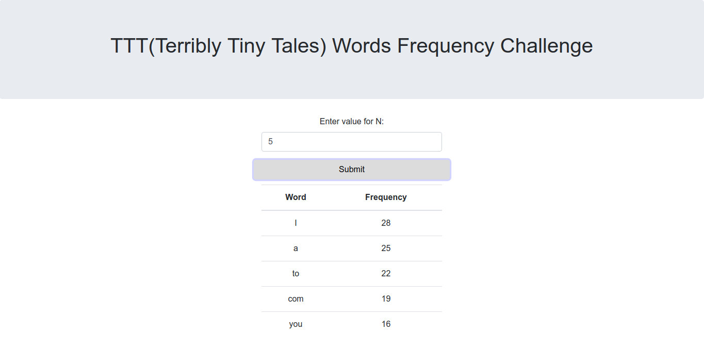
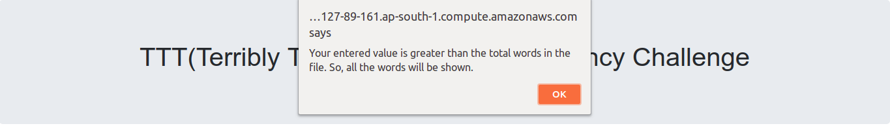

# ttt-words-frequency-challenge
This is the challenge project given by TTT(Terribly Tiny Tales). The main task here is to get top N most frequent words in the file that is given by TTT. Complete solution contains two parts. You can check the working solution at <a href="http://ec2-13-127-89-161.ap-south-1.compute.amazonaws.com">ec2-13-127-89-161.ap-south-1.compute.amazonaws.com</a>

## Part-1 (Frontend, with Angular5):
Frontend part is a web application created using Angular framework. Here user enters a number N(Number of words) and response will be shown in the form of a table as you can see in the screenshot below:

## Part-2 (Backend, with Node.js v10.5.0):
Backend part is the core part where actually frequecy of the words get calulated. Here, a number N(From Frontend) is received as a part of request url and then the text file given is read and an JSON array is returned as a response to Frontend.

## Test Cases:
Here are some basic test cases:

### Case-1 (Blank value):
If user submit a request with blank field then a message will be displayed says <b>"Invalid Input!!!: Please give a valid positive number."</b> as you can see in screenshot below:

### Case-2 (Negative value):
If user submit a negative value then simmillar message will be shown like one in case 1.

### Case-3 (N is greater than total number of words in the text file):
If number entered by user is greater than total number of words in the file then a message will be shown like <b>"Your entered value is greater than the total words in the file. So, all the words will be shown."</b>

### Plugins Used:

<ul>
	<li>body-parser: 1.18.3 (Node.js)</li>
	<li>express: 4.16.3 (Node.js)</li>
	<li>request: 2.87.0 (Node.js)</li>
	<li>Angular CLI (Angular5)</li>
</ul>

